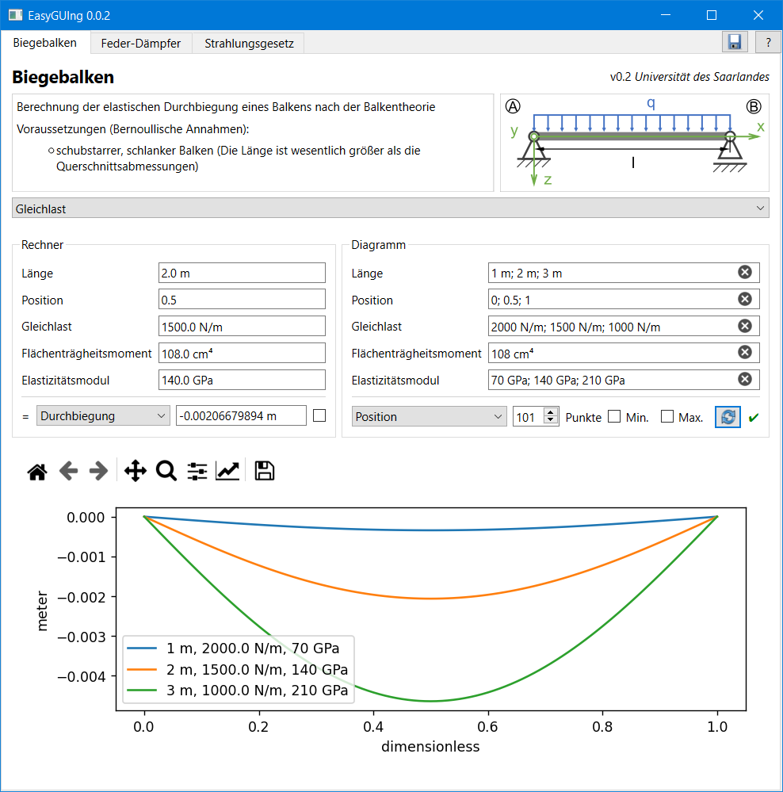

[](README.de.md)
[](COPYING)
[](https://github.com/s-quirin/EasyGUIng/releases)
[](Pipfile.lock)
[](Pipfile.lock)
[](Pipfile.lock)
[](Pipfile.lock)

# EasyGUIng
## Ein Framework zur Bereitstellung mathematischer Modelle mit Benutzeroberfläche
>Modell und GUI sind einfach zu erstellen für den Fachexperten und einfach zu nutzen für den Endanwender.




## Ziele
- [x] Kann vom Fachexperten mit **geringen Programmierkenntnissen** gespeist werden
  - Die notwendige Programmierung ist auf den mathematischen Algorithmus beschränkt.
- [x] Kann an **jeden beliebigen** Nutzer verteilt und von diesem bedient werden
  - Die Verteilung ist unkompliziert und wird nicht durch Lizenzen limitiert.
- [x] Beliebige Komplexität der mathematischen Modelle und vollständige Freiheit in der Umsetzung
  - analytisch, numerisch, Machine Learning etc.

## Installation
Eine *Installation* ist nicht notwendig. Laden Sie sich eine [Release-Version](https://github.com/s-quirin/EasyGUIng/releases) herunter, entpacken sie und starten die enthaltene `EasyGUIng.exe`. Erstellen Sie mit [dieser Anleitung](#modellerstellung) direkt Ihr eigenes Modell.

Finden Sie keine für Ihr System passende Version, probieren Sie die Ausführungen zur [manuellen Installation](#manuelle-installation-in-python) in Python.

Unterstützung bei der Installation und bei der Implementierung Ihres Modells erhalten Sie gegen Entgelt beim [Lehrstuhl für Leichtbausysteme der Universität des Saarlandes](https://www.uni-saarland.de/lehrstuhl/herrmann). Gerne bieten [wir](https://www.uni-saarland.de/lehrstuhl/herrmann/team) Ihnen auch eine Kooperation in einem Forschungsprojekt an.

## Modellerstellung
- Erfolgt im Ordner `\model` als Textdatei mit Python-Code in der Form `Kurztitel.py`
- Der Inhalt kann aus den [frei verfügbaren](/model), kommentierten Beispielen kopiert werden.
- Erklärende Grafiken können als Vektorgrafiken (`Kurztitel.svg`) oder als Bilddateien (`.png` etc.) abgelegt werden.

### Wie kann ich die Beispielmodelle anpassen?
1) Entfernen Sie den Lizenztext ab Zeile 4 und ersetzen Sie ihn durch Ihren eigenen, wenn Sie Ihr Modell nicht frei der Allgemeinheit zur Verfügung stellen möchten.
1) Belassen Sie die sonstigen Kommentare (`#…`) und ändern Sie nicht die mit `# init` kommentierten Zeilen.
1) Füllen Sie zur Modellbeschreibung Titel, Beschreibung, Autor/Kontakt und Version mit Ihren anzuzeigenden Daten.
    >Tipp: Für `description` können Sie die Auszeichnungssprache [Markdown](https://de.wikipedia.org/wiki/Markdown) verwenden.
1) `option` listet mögliche Auswahlwerte. `option['output']` bezeichnet dabei die möglichen Werte für die Ausgabe (y-Werte).
    >Tipp: Erklärende Grafiken können abhängig von `option` angezeigt werden (max. 9 verschiedene je `option`), indem Sie mehrere Grafiken `Kurztitel011.svg`, `Kurztitel021.svg` etc. hinterlegen. Die Position der Ziffern beschreibt die `option`, die Ziffer selbst die Auswahl. Eine `0` (hier an erster Stelle) bedeutet, dass die Grafik unabhängig von der Auswahl der (ersten) Option angezeigt wird.
1) Füllen Sie die Informationen für Eingabewerte `input[…]` nach dem angegebenen Schema. Verwenden Sie für `x` einen für dieses Modell eindeutigen Formelbuchstaben. Weitere Werte sind optional und dienen zur Darstellung entsprechender Graphen oder der Anzeige nur bei vorheriger Auswahl von `option`.
    ```
    input['x'] = ('Name', Standardwert, 'Einheit')    # Minimalschema
    input['x'] = ('Name', (minimaler Wert, …, maximaler Wert), 'Einheit', (option['o1'][1], 'option2b'))
    ```
1) `plotX` legt die standardmäßig beim Start zu nutzende Laufvariable `'x'` (x-Achse des Diagramms) fest.
1) Die Berechnungsvorschrift für das Modell findet sich in der Funktion `calculate` unter Nutzung von [NumPy](https://numpy.org/doc/stable/). Sie können zuvor definierte Variablen `input['x']` als `var['x']` und die Namen von Auswahlwerten `option` als `opt` verwenden. Benötigte Konstanten definieren Sie sich in `calculate` mit `c = Q_(Wert, 'Einheit')`.

### Sonderfall: Abschnittsweise definierte Funktionen
Viele mathematische Funktionen müssen abschnittsweise gelöst werden, da an bestimmten Stellen Unstetigkeiten auftreten und Divisionen durch Null nicht durchgeführt werden können. Hier hilft der Import und der Aufruf der Hilfsfunktionen `\model\f_helper.py`:
```
import model.f_helper as hp    # Hilfsfunktionen importieren
# Iteriere 'function' über abschnittsweise definierte Variablen namens 'keys'
result = hp.piecewise(function, var, keys)
```

## Manuelle Installation in Python
>Hier erfahren Sie, wie Sie das Programm lokal in einer Python-Umgebung ausführen.

Sie benötigen eine Installation von Python 3.10 auf Ihrem System, z. B. aus dem [Microsoft Store](https://apps.microsoft.com/store/detail/python-310/9PJPW5LDXLZ5). Öffnen Sie in einer Python Konsole das Verzeichnis, in das Sie die [Projektdateien](/) heruntergeladen haben. Führen Sie nacheinander die folgenden Befehle aus.  
1. Prüfen Sie, ob `pip` installiert ist und installieren Sie `pipenv`:  
    ```shell
    python -m pip --version
    pip install pipenv
    ```
2. Generieren und starten Sie eine virtuelle Umgebung mit allen erforderlichen Abhängigkeiten:  
    ```shell
    pipenv --python 3.10
    pipenv install
    pipenv shell
    ```
3. Von hier aus können Sie das Programm direkt starten:
    ```shell
    python EasyGUIng.py
    ```
4. Möchten Sie ein gebündeltes Paket zum Verteilen (vgl. [Releases](https://github.com/s-quirin/EasyGUIng/releases)), erhalten Sie Support beim [Lehrstuhl für Leichtbausysteme der Universität des Saarlandes](https://www.uni-saarland.de/lehrstuhl/herrmann).

## Credits:
* 2022 – heute: [Steven Quirin](https://github.com/s-quirin), Universität des Saarlandes
