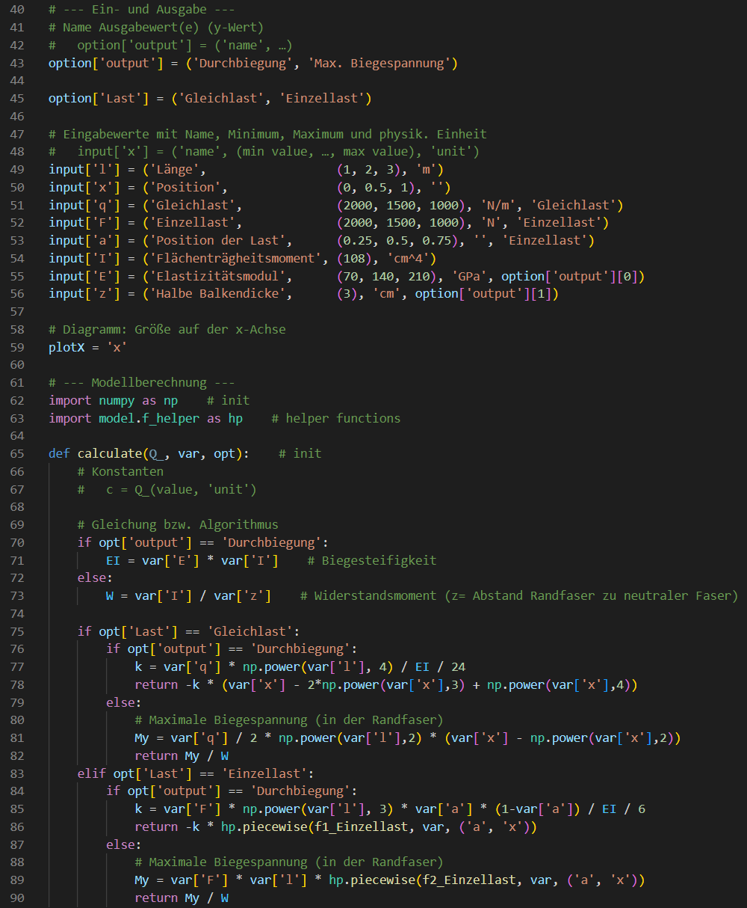
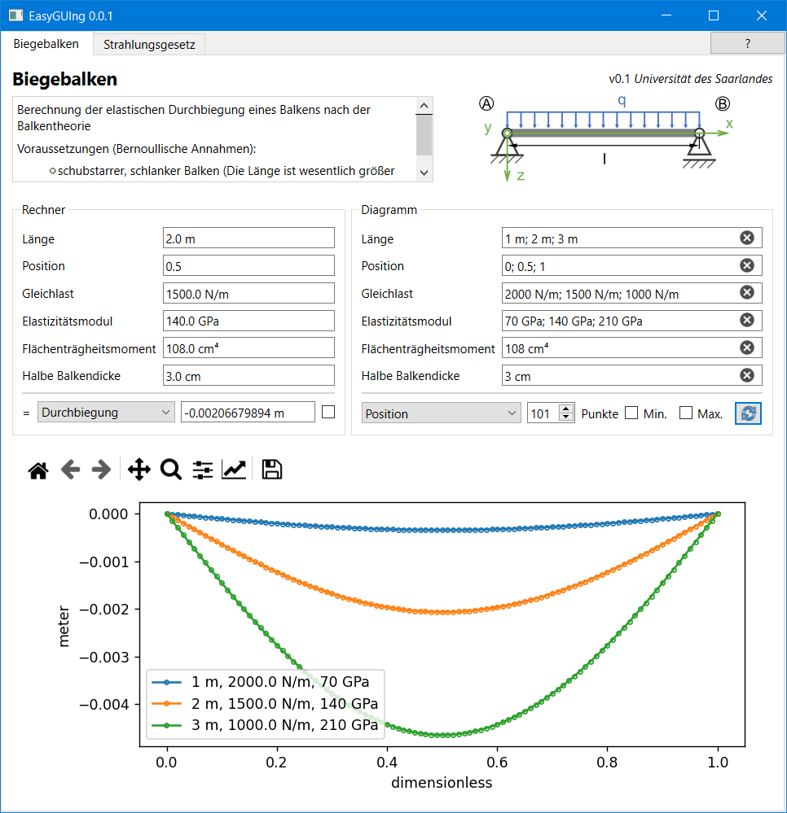

[](README.de.md)
[](COPYING)
[](https://github.com/s-quirin/EasyGUIng/releases)
[](Pipfile.lock)
[](Pipfile.lock)
[](Pipfile.lock)
[](Pipfile.lock)
[](Pipfile.lock)

# EasyGUIng
## A framework for providing mathematical models with a graphical user interface

>The model and GUI are simple to build for subject matter experts and simple to use for end users.

Empower your specialist department with streamlined Python programming that requires less code. Avoid the need to introduce a low-code platform and stay free and independent.

As an example, here is the code required for an Euler–Bernoulli flexural beam:



After restarting the application, you will see this user interface generated by the framework:



## Objectives
- [x] Can be populated by subject matter experts with **minimal programming knowledge**
  - The necessary programming is limited to the mathematical algorithm.
- [x] Can be distributed to **any** user and operated by them
  - Distribution is straightforward and is not restricted by licences.
- [x] Mathematical models of any complexity and complete freedom in implementation
  - analytical, numerical, machine learning, etc.

## Included (analytical) example models
- Euler–Bernoulli beam theory
- Spring-damper system
- Planck’s radiation law
- Beer–Lambert law

## Installation
No *installation* is required. Download a [Release-Version](https://github.com/s-quirin/EasyGUIng/releases), unzip it and run the `EasyGUIng.exe` file included. Follow [these instructions](#model-creation) to create your own model straight away.

If you cannot find a version suitable for your system, try the instructions for [manual installation](#manual-installation-in-python) in Python.

Support with the installation and implementation of your model is available upon request. Just contact [me](https://steven.quirin.eu/).

## Model-creation
- In the `\model` folder, create a text file containing Python code, in the format `ShortTitle.py`
- The content can be copied from the commented, [freely available](/model) examples.
- Illustrative graphics can be stored as vector graphics (`ShortTitle.svg`) or as image files (`.png`, etc.).

### How can I customise the example models?
1) Remove the licence text from line 4 onwards and replace it with your own if you do not wish to make your model freely available to the general public.
1) Leave the other comments (`#…`) as they are and do not change the lines commented with `# init`.
1) Fill in the model description fields – title, description, author/contact and version – with the details you wish to display.
    >Tip: You can use [Markdown](https://de.wikipedia.org/wiki/Markdown) for the `description` field.
1) `option` is the list of selectable values. `option['output']` refers to the possible values for the output (y-values).
    >Tip: Illustrative graphics can be displayed depending on `option` (max. 9 different ones per `option`), by providing several graphics such as `ShortTitle011.svg`, `ShortTitle021.svg`, etc. The position of the digits represents the `option`, whilst the digit itself denotes the selection. A `0` (here in the first position) means that the graphic is displayed regardless of the selection of the (here first) option.
1) Enter the information for the input values `input[…]` according to the specified format. In place of `x` use any formula letter that is unique to this model. Further parameters are optional and are used to plot additional graphs or to show them only if `option` has been selected.
    ```python
    input['x'] = ('Name', default value, 'unit')    # Minimal schema
    input['x'] = ('Name', (minimum value, …, maximum value), 'unit', (option['o1'][1], 'option2b'))
    ```
1) `plotX` sets the run variable `'x'` (the x-axis of the plot) to be used by default on start-up.
1) The calculation formula for the model is to be found in the `calculate` function, using [NumPy](https://numpy.org/doc/stable/). You can use previously defined variables `input['x']` as `var['x']` and the names of selectable values `option` as `opt`. Define any constants you require in `calculate` using `c = Q_(value, 'unit')`.

### Special case: Functions defined in intervals
Many mathematical functions must be solved in intervals, as discontinuities occur at certain points and division by zero cannot be carried out. Importing and calling the helper functions `\model\f_helper.py` is the way to go:
```python
import model.f_helper as hp    # Import helper functions
# Iterate 'function' over variables named 'keys' interval by interval
result = hp.piecewise(function, var, keys)
```

## Manual installation in Python
>Find out how to run the programme locally in a Python environment.

You will need [](Pipfile.lock) installed on your system, for example from the [Microsoft Store](https://apps.microsoft.com/detail/9nrwmjp3717k). In a Python console, navigate to the directory where you downloaded the [project files](/). Run the following commands one after the other.  
1. Check whether `pip` is installed and install `pipenv`:  
    ```shell
    python -m pip --version
    pip install pipenv
    ```
2. Generate and launch a virtual environment with all the necessary dependencies:  
    ```shell
    pipenv --python 3.11
    pipenv install
    pipenv shell
    ```
3. You can launch the programme directly from here:
    ```shell
    python EasyGUIng.py
    ```
4. If you would like a bundled package for distribution (see [Releases](https://github.com/s-quirin/EasyGUIng/releases)), contact [me](https://steven.quirin.eu/) for support.

## Supported Languages
- German: [Liesmich](README.de.md)

## Credits:
* 2022 – present: [Steven Quirin](https://github.com/s-quirin), Saarland University

